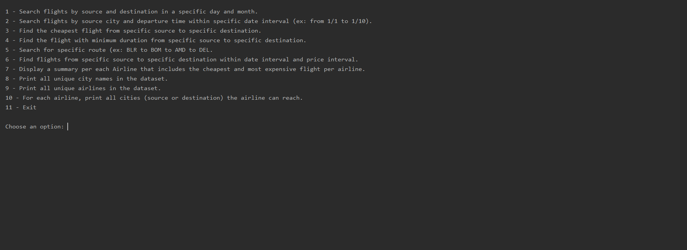

# CS210-Final-Project
A python data science final project with Gavin Horner

## ABOUT
This is a flight information system using a dataset of all major domestic flights for India in 2019.
Our dataset that we used can be found here https://www.kaggle.com/vinaypratap/flight-price 

Keep in mind that any prices mentioned are in Indian Rupees.

## AUTHORS
Evan Colwell & Gavin Horner

## USAGE
You can run this program by doing the following 

```python3 path/to/project/CS210-Final-Project/main.py```

It will run as a command line program and will require your input to run specific functions.

#### DEPENDENCIES 

Python 3 is required for our project. The only one tested was Python 3.8.6.

## SCREENSHOTS



Here is what you are greeted by when you start the program, you enter in a number corresponding 
to the function you want to run. Gavin and I worked evenly on this where we each worked on half of the 
program, he worked on the odd functions (and he also wrote the base for the python code) and I worked on the
even functions.

